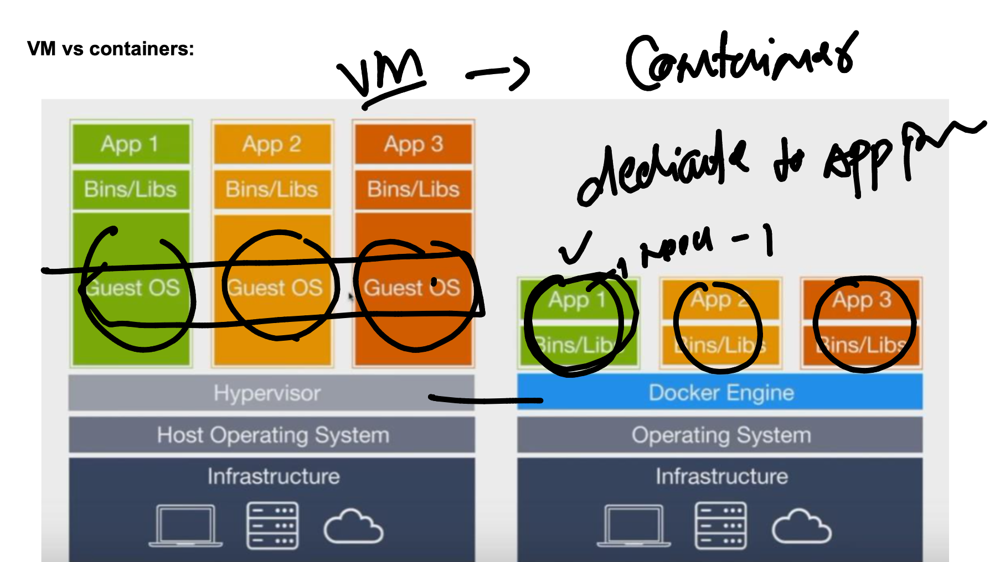

# BMO_Ecs-Eks-Ecr -- Day 1

### VM vs containers 



### COntrainer runtimes 


### Container with kernel support 


### Using Docker Desktop on windows / mac to create Linux containers


### to create containers we need container images 


## Docker operations 

### pull --

### run to create container from image 


### container with ping fb.com process

```
docker  run  --name ashuc1  -d   alpine  ping fb.com 
```

### COntainer life cycle 


### implementing 


