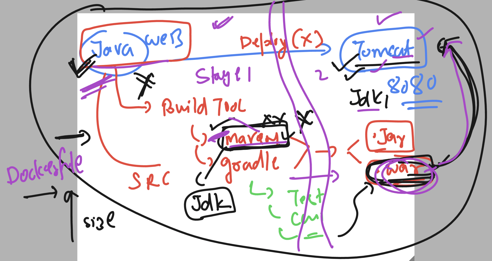
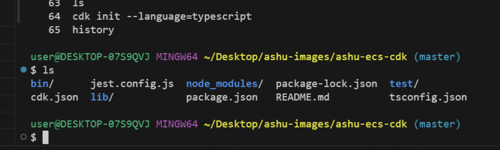

# BMO_Ecs-Eks-Ecr  -- Day 2

## Revision 

### app containers 

### Understanding javaspring webapp

### Multi Stage Dockerfile 

## RUnning multiple containers across multiple server gonna lead to given prob

### Solution by Container orchestration tools 

## Introduction to cloud base solution 

### INto to ECS 

### Intro to ECS arch 

### ECs arch new 

### setup of ECS options

### setup of ECS using CDK -- checking details 

### CDK init 

