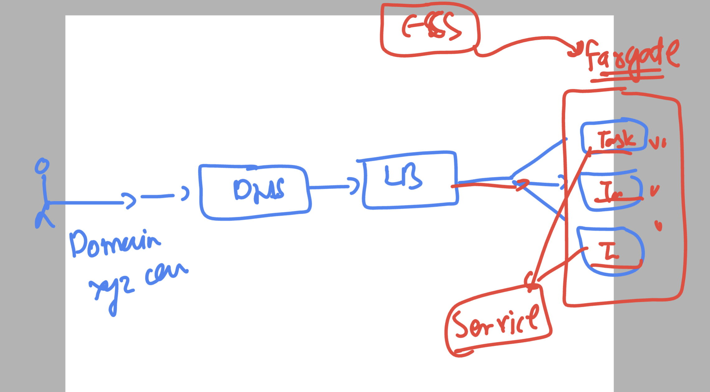
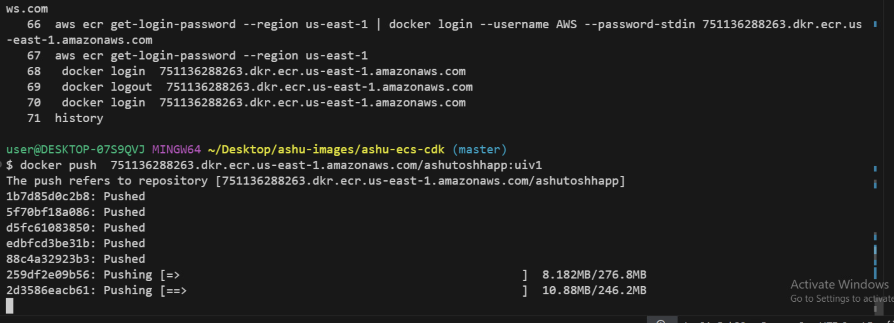
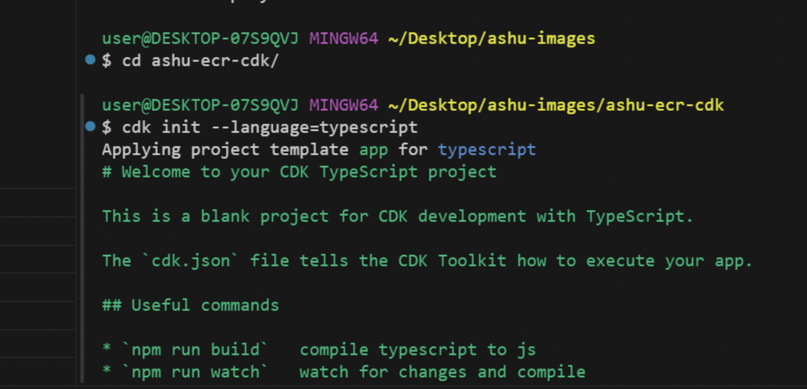
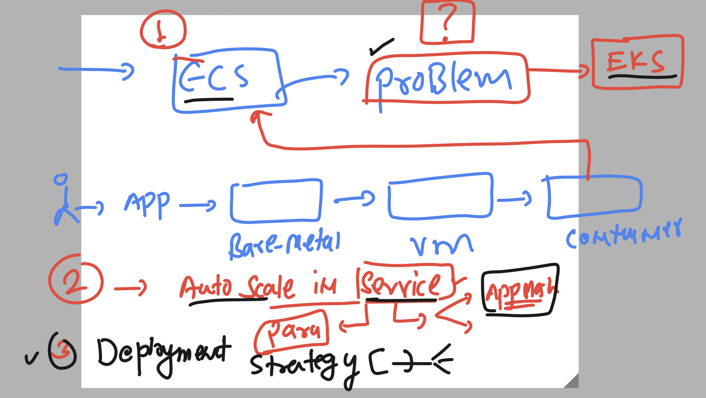

# BMO_Ecs-Eks-Ecr -- Day3

## Revision 
### Container process revision 

### ECS Revision 

### Single Docker image with Multi stage app like Dev | UAT | PROD 

### passing env 

### pushing image to Docker hub 

### Extending traffic management to Service 

### pushing image to ECR 

### CDK for ECR 

## Home work -- learning for concepts 

