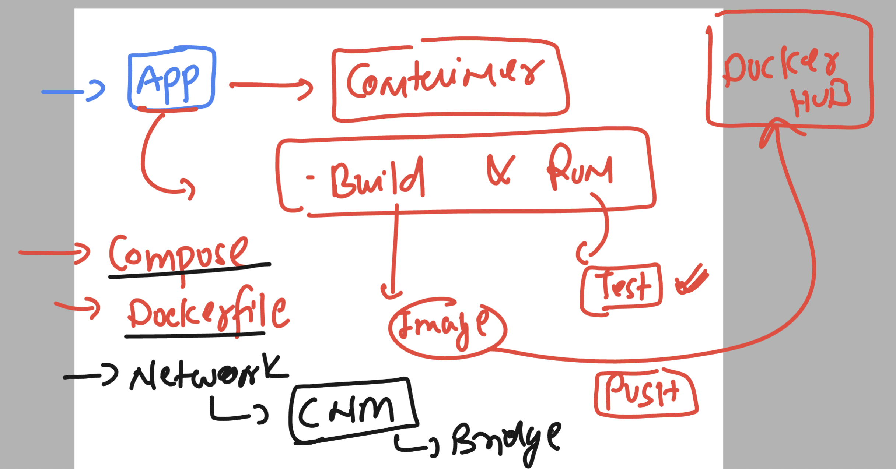
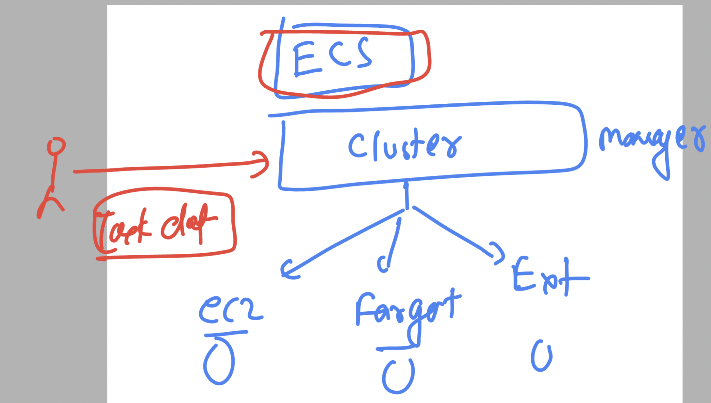
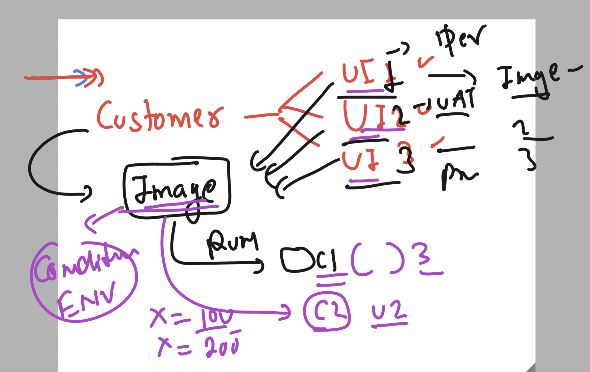
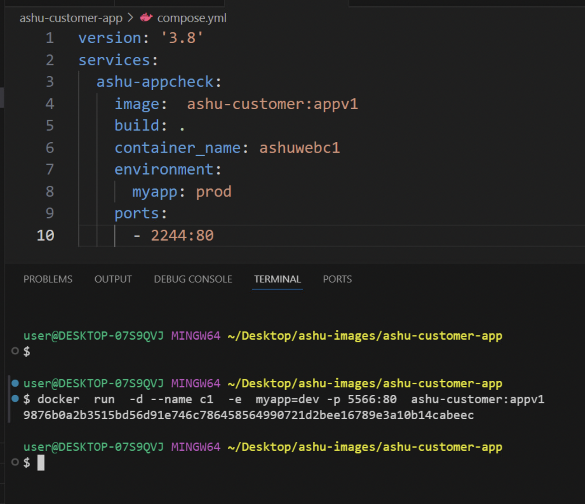

# BMO_Ecs-Eks-Ecr -- Day3

## Revision 
### Container process revision 

### ECS Revision 

### Single Docker image with Multi stage app like Dev | UAT | PROD 

### passing env 

### pushing image to Docker hub 

