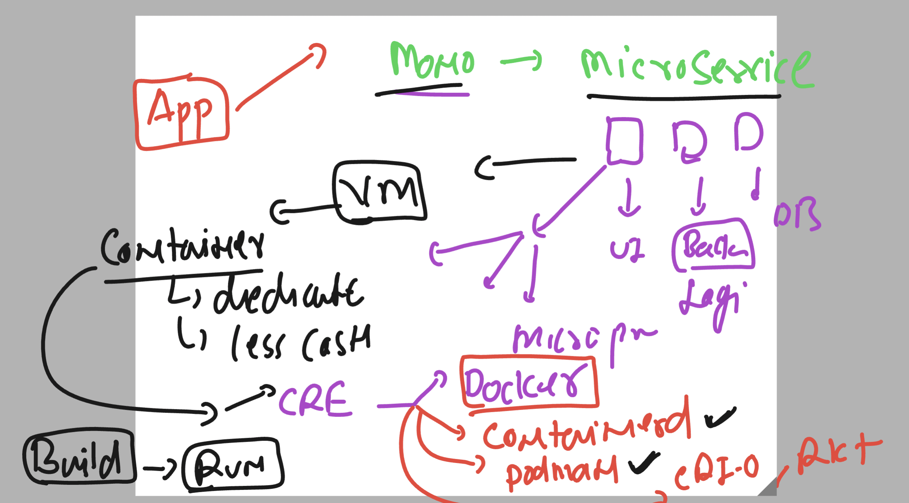
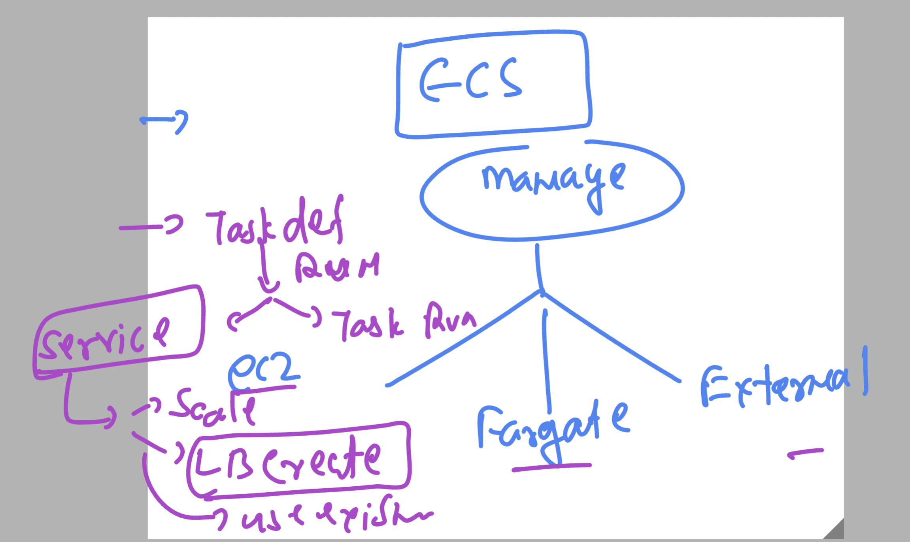
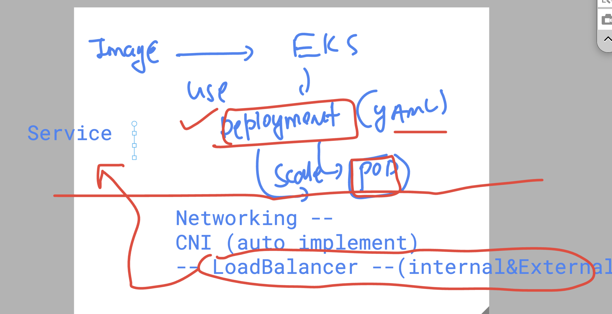

# BMO_Ecs-Eks-Ecr -- Day 4

### Revision 

## Container Runtimes (CRE) as choice 

## ECS restrictions 

### ECS in oneGO 

### COntainer as SIngle process 

### CMD vs Entrypoint 

## K8s architecture 

## ApiServer 

### EtCD 

### KUberentes workern node 

## Setup k8s 

### EKS offering 

### CDK for EKS 

### Please Install aws cli 2.15 

### Download kubeconfig file 

---

### Final eks architecture 

### Kubectl life cycle commands 

## checking version 

### getnodes 

### task vs pod 

## Creating pod manifest using kubectl 

### veritical scaling in pod 

## Deployment controller comes in picture

### Creating deployment -- which will create pod 

### Deployment can scale pod manually / automatically 

### login to pod container 

### EKS in single line 

### Loadbalacing in EKS External & internal 

### Creating Loadbalancer using Service Resources in k8s 

## Creating External & internal LB 

