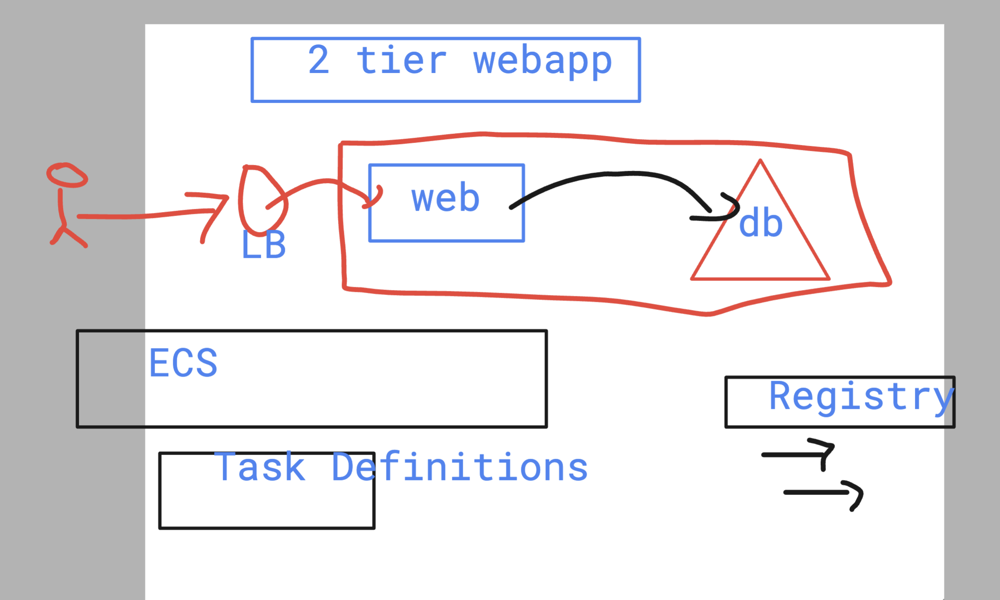
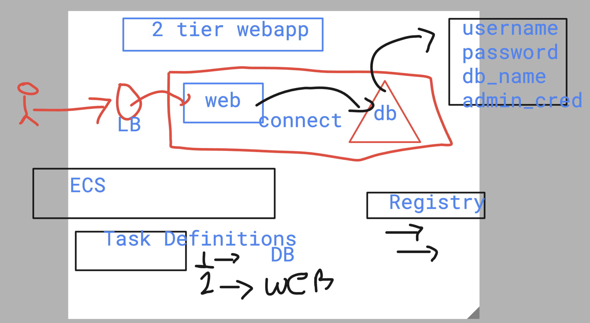
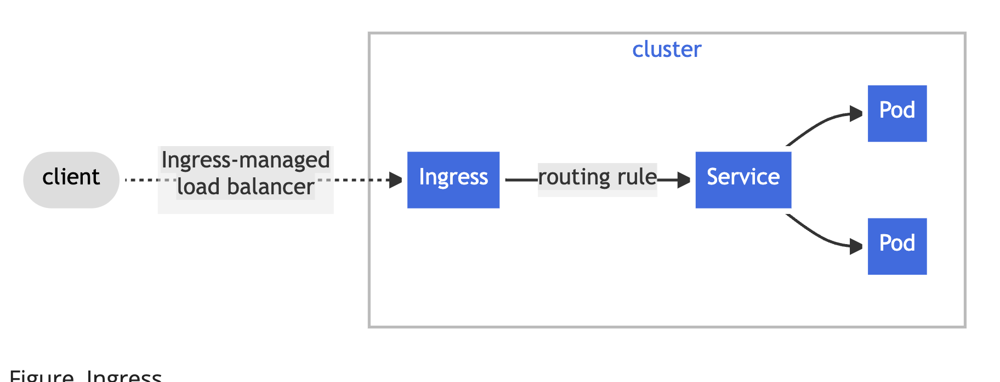
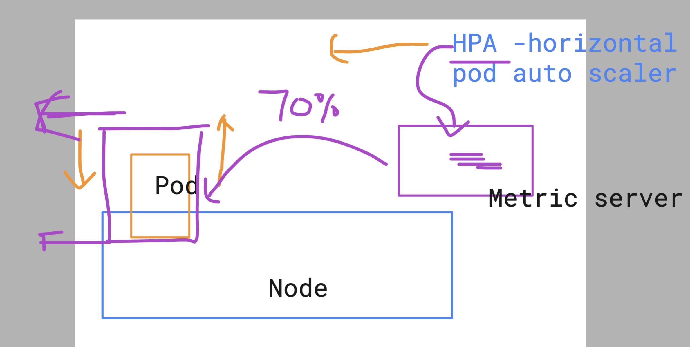
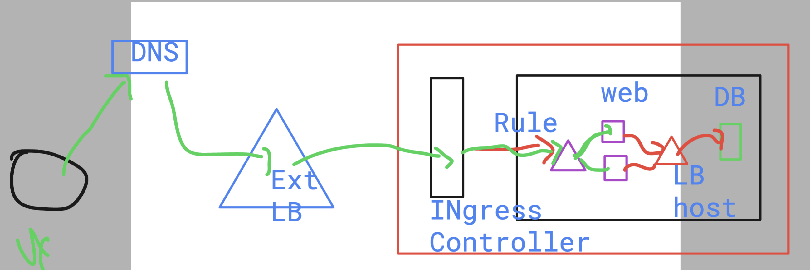

# BMO_Ecs-Eks-Ecr -- Day 5 

## Two Tier webapp -- (Frontend+login / DB )



### more details 



### command to update 

```
 aws eks update-kubeconfig --name cdkekscluster-common-donotdelet --region us-east-1 --role-arn arn:aws:iam::751136288263:role/AshuEksCkdWithvpcStack1-EksAdminRole1C96C514-RkqROie9QinK
```

### kUbectl  command to creat deployment 

```
kubectl create  deployment  ashu-app-deploy --image=dockerashu/ashu-customer:bmoappv1  --port 80  --dry-run=client -o yaml 
```

### Creating it

```
kubectl create -f ashu-deploy.yml
deployment.apps/ashu-app-deploy created
 humanfirmware@darwin  ~/BMO_Ecs-Eks-Ecr/k8s-manifest   master ±  

```

### more kubectl 

```
humanfirmware@darwin  ~/Desktop  kubectl  get  nodes
NAME                           STATUS   ROLES    AGE     VERSION
ip-10-0-133-184.ec2.internal   Ready    <none>   24m     v1.29.3-eks-ae9a62a
ip-10-0-188-181.ec2.internal   Ready    <none>   6h25m   v1.29.3-eks-ae9a62a
ip-10-0-193-46.ec2.internal    Ready    <none>   24m     v1.29.3-eks-ae9a62a
ip-10-0-213-73.ec2.internal    Ready    <none>   6h28m   v1.29.3-eks-ae9a62a
ip-10-0-231-96.ec2.internal    Ready    <none>   6h25m   v1.29.3-eks-ae9a62a
ip-10-0-248-219.ec2.internal   Ready    <none>   6h25m   v1.29.3-eks-ae9a62a
 humanfirmware@darwin  ~/Desktop  kubectl get po 
NAME                                 READY   STATUS    RESTARTS   AGE
amir-app-deploy-8754c9559-6btjq      1/1     Running   0          30s
ashu-app-deploy-5f84755c8c-xxkqv     1/1     Running   0          6m59s
bh-app-deploy-897785f7-bl8p7         1/1     Running   0          6m41s
hisham-app-deploy-68b9564cb-9c6hh    1/1     Running   0          4m17s
john-app-deploy-79f45ccc55-hhgz8     1/1     Running   0          7m33s
naga-eksnew-deploy-fb97647c5-9ghbw   1/1     Running   0          4m45s
raj-app-deploy-5c8466ccb9-tpbcd      1/1     Running   0          114s
sdai-day5-deploy-84cf8bbcbc-f58qq    1/1     Running   0          2m33s
shahin-web-deploy-5cb48f48bf-mhgvf   1/1     Running   0          6m38s
umar-web-deploy-7fc884768d-dd69l     1/1     Running   0          2m14s
victor-app-deploy-7857d8f655-hsp56   1/1     Running   0          6m34s
 humanfirmware@darwin  ~/Desktop  kubectl get po ashu-app-deploy-5f84755c8c-xxkqv   -o wide
NAME                               READY   STATUS    RESTARTS   AGE     IP            NODE                           NOMINATED NODE   READINESS GATES
ashu-app-deploy-5f84755c8c-xxkqv   1/1     Running   0          7m14s   10.0.183.35   ip-10-0-133-184.ec2.internal   <none>           <none>
 humanfirmware@darwin  ~/Desktop  kubectl  get po -o wide
NAME                                 READY   STATUS    RESTARTS   AGE     IP             NODE                           NOMINATED NODE   READINESS GATES
amir-app-deploy-8754c9559-6btjq      1/1     Running   0          62s     10.0.243.200   ip-10-0-193-46.ec2.internal    <none>           <none>
ashu-app-deploy-5f84755c8c-xxkqv     1/1     Running   0          7m31s   10.0.183.35    ip-10-0-133-184.ec2.internal   <none>           <none>
bh-app-deploy-897785f7-bl8p7         1/1     Running   0          7m13s   10.0.235.243   ip-10-0-231-96.ec2.internal    <none>           <none>
hisham-app-deploy-68b9564cb-9c6hh    1/1     Running   0          4m49s   10.0.202.207   ip-10-0-193-46.ec2.internal    <none>           <none>
john-app-deploy-79f45ccc55-hhgz8     1/1     Running   0          8m5s    10.0.201.1
```

### manual horizontal scaling 

```
kubectl scale deployment ashu-app-deploy   --replicas=3
deployment.apps/ashu-app-deploy scaled

```

### Creating LB using service 

### 4 type of service 

```
kubectl  create  service    
Create a service using a specified subcommand.

Aliases:
service, svc

Available Commands:
  clusterip      Create a ClusterIP service
  externalname   Create an ExternalName service
  loadbalancer   Create a LoadBalancer service
  nodeport       Create a NodePort service


```

### Creating it 

```
 
 humanfirmware@darwin  ~/BMO_Ecs-Eks-Ecr/k8s-manifest   master ±  kubectl  expose deployment ashu-app-deploy  --type Lo
adBalancer  --port 80  --name ashulb1  --dry-run=client -o yaml >ashulb1.yaml
 humanfirmware@darwin  ~/BMO_Ecs-Eks-Ecr/k8s-manifest   master ±  kubectl  create -f ashulb1.yaml 
service/ashulb1 created
 humanfirmware@darwin  ~/BMO_Ecs-Eks-Ecr/k8s-manifest   master ±  kubectl  get  svc 
NAME         TYPE           CLUSTER-IP       EXTERNAL-IP                                                              PORT(S)        AGE
ashulb1      LoadBalancer   172.20.190.102   afe01030c2a2044cd852fb49f2fdd56f-100576463.us-east-1.elb.amazonaws.com   80:32597/TCP   11s
```

## Introduction to Ingress controller 



### namespaces in k8s


### Creating namespaces

```
              Active   6h28m
 humanfirmware@darwin  ~/Desktop  kubectl  create  namespace  ashu-project  --dry-run=client -o yaml 
apiVersion: v1
kind: Namespace
metadata:
  creationTimestamp: null
  name: ashu-project
spec: {}
status: {}
 humanfirmware@darwin  ~/Desktop  kubectl  create  namespace  ashu-project                           
namespace/ashu-project created
 humanfirmware@darwin  ~/Desktop  kubectl  get  ns                                                   
NAME              STATUS   AGE
appmesh-system    Active   7h14m
ashu-project      Active   12s
default           Active   7h32m
ingress-nginx     Active   5h3m
kube-node-lease   Active   7h32m
kube-public       Active   7h32m

```

### Creating & setting default ns

```
 humanfirmware@darwin  ~/Desktop  kubectl config set-context --current --namespace ashu-project
Context "arn:aws:eks:us-east-1:751136288263:cluster/cdkekscluster-common-donotdelet" modified.
 humanfirmware@darwin  ~/Desktop  kubectl  get  pods
No resources found in ashu-project namespace.
 humanfirmware@darwin  ~/Desktop  

```

## Creating internal LB inside EKS 

```
humanfirmware@darwin  ~/BMO_Ecs-Eks-Ecr/k8s-manifest   master ±  kubectl get  deploy
NAME              READY   UP-TO-DATE   AVAILABLE   AGE
ashu-app-deploy   3/3     3            3           3m37s
 humanfirmware@darwin  ~/BMO_Ecs-Eks-Ecr/k8s-manifest   master ±  kubectl expose deployment ashu-app-deploy  --type ClusterIP --port 80 --targe
t-port 80 --name ashu-internal-lb --dry-run=client -o yaml  >internal_lb.yml
 humanfirmware@darwin  ~/BMO_Ecs-Eks-Ecr/k8s-manifest   master ±  ls 
ashu-deploy.yml ashulb1.yaml    internal_lb.yml
 humanfirmware@darwin  ~/BMO_Ecs-Eks-Ecr/k8s-manifest   master ±  kubectl create -f internal_lb.yml 
service/ashu-internal-lb created
 humanfirmware@darwin  ~/BMO_Ecs-Eks-Ecr/k8s-manifest   master ±  kubectl  get  svc
NAME               TYPE        CLUSTER-IP      EXTERNAL-IP   PORT(S)   AGE
ashu-internal-lb   ClusterIP   172.20.64.207   <none>        80/TCP    8s
 humanfirmware@darwin  ~/BMO_Ecs-Eks-Ecr/k8s-manifest   master ±  


```

### INstall Nginx ingress controller in EKS 

```
kubectl  apply -f https://raw.githubusercontent.com/kubernetes/ingress-nginx/main/deploy/static/provider/aws/deploy.yaml
```
### verify ingress

```
humanfirmware@darwin  ~/Desktop  kubectl  get po -n ingress-nginx
NAME                                        READY   STATUS      RESTARTS   AGE
ingress-nginx-admission-create-chwv8        0/1     Completed   0          6h18m
ingress-nginx-admission-patch-dhq4w         0/1     Completed   0          6h18m
ingress-nginx-controller-57b7568757-sl6sj   1/1     Running     0          6h18m
 humanfirmware@darwin  ~/Desktop  
 humanfirmware@darwin  ~/Desktop  kubectl  get svc  -n ingress-nginx  
NAME                                 TYPE           CLUSTER-IP       EXTERNAL-IP                                                                     PORT(S)                      AGE
ingress-nginx-controller             LoadBalancer   172.20.252.238   a6931b72bbf9b46a6bb8ded2ed82ddc3-5d47f6a6f5292bfb.elb.us-east-1.amazonaws.com   80:31906/TCP,443:30885/TCP   6h19m
ingress-nginx-controller-admission   ClusterIP      172.20.189.23    <none>                                                                          443/TCP                      6h19m
 humanfirmware@darwin  ~/Desktop  

```

## Deploy app with web & 

### Db yaml

```
kubectl  create deployment ashu-db --image mysql --port 3306 --dry-run=client -o yaml >db_deploy.yml
```

### Creating secret to store dbcred

```
 kubectl create secret generic ashu-db-cred  --from-literal  MYSQL_USER=ashu  --from-literal MYSQL_PASSWORD=Ashudb@12345 --from-literal MYSQL_ROOT_PASSWORD=AdminPass@12345  --dry-run=client -o yaml >dbsecret.yaml
 humanfirmware@darwin  ~/BMO_Ecs-Eks-Ecr/k8s-manifest/ashu-web-2tier   master ±  kubectl create -f dbsecret.yaml 
secret/ashu-db-cred created
 humanfirmware@darwin  ~/BMO_Ecs-Eks-Ecr/k8s-manifest/ashu-web-2tier   master ±  kubectl get secret
NAME           TYPE     DATA   AGE
ashu-db-cred   Opaque   3      10s
 humanfirmware@darwin  ~/BMO_Ecs-Eks-Ecr/k8s-manifest/ashu-web-2tier   master ±  
```

### Understanding HPA 



### Creating web

```
humanfirmware@darwin  ~/BMO_Ecs-Eks-Ecr/k8s-manifest/ashu-web-2tier   master ±  kubectl get deploy 
NAME       READY   UP-TO-DATE   AVAILABLE   AGE
ashu-db    1/1     1            1           31m
ashu-web   1/1     1            1           109s
 humanfirmware@darwin  ~/BMO_Ecs-Eks-Ecr/k8s-manifest/ashu-web-2tier   master ±  kubectl  expose deployment  ashu-web --type ClusterIP --port 8
080 --name ashu-web-lb --dry-run=client -o yaml >websvc.yml
 humanfirmware@darwin  ~/BMO_Ecs-Eks-Ecr/k8s-manifest/ashu-web-2tier   master ±  kubectl create -f websvc.yml 
service/ashu-web-lb created
 humanfirmware@darwin  ~/BMO_Ecs-Eks-Ecr/k8s-manifest/ashu-web-2tier   master ±  kubectl get svc
NAME          TYPE        CLUSTER-IP       EXTERNAL-IP   PORT(S)    AGE
ashu-db-lb    ClusterIP   172.20.230.62    <none>        3306/TCP   24m
ashu-web-lb   ClusterIP   172.20.228.241   <none>        8080/TCP   10s
 humanfirmware@darwin  ~/BMO_Ecs-Eks-Ecr/k8s-manifest/ashu-web-2tier   master ±  
```

### app routes




### HPA 

```
humanfirmware@darwin  ~/BMO_Ecs-Eks-Ecr/k8s-manifest/ashu-web-2tier   master ±  ls
db_deploy.yml  dbsecret.yaml  dbsvc.yml      webdeploy.yaml websvc.yml
 humanfirmware@darwin  ~/BMO_Ecs-Eks-Ecr/k8s-manifest/ashu-web-2tier   master ±  kubectl get deploy
NAME       READY   UP-TO-DATE   AVAILABLE   AGE
ashu-db    1/1     1            1           74m
ashu-web   1/1     1            1           45m
 humanfirmware@darwin  ~/BMO_Ecs-Eks-Ecr/k8s-manifest/ashu-web-2tier   master ±  kubectl autoscale deployment ashu-web 
 --cpu-percent 60 --min 2 --max 20 --dry-run=client -o yaml 
apiVersion: autoscaling/v1
kind: HorizontalPodAutoscaler
metadata:
  creationTimestamp: null
  name: ashu-web
spec:
  maxReplicas: 20
  minReplicas: 2
  scaleTargetRef:
    apiVersion: apps/v1
    kind: Deployment
    name: ashu-web
  targetCPUUtilizationPercentage: 60
status:
  currentReplicas: 0
  desiredReplicas: 0
 humanfirmware@darwin  ~/BMO_Ecs-Eks-Ecr/k8s-manifest/ashu-web-2tier   master ±  kubectl autoscale deployment ashu-web  --cpu-percent 60 --min 2 --max 20 --dry-run=client -o yaml >hpa.yml
 humanfirmware@darwin  ~/BMO_Ecs-Eks-Ecr/k8s-manifest/ashu-web-2tier   master ±  kubectl create -f hpa.yml 
horizontalpodautoscaler.autoscaling/ashu-web created
 humanfirmware@darwin  ~/BMO_Ecs-Eks-Ecr/k8s-manifest/ashu-we
```

### hpa works

```
 humanfirmware@darwin  ~/Desktop  kubectl get deploy
NAME       READY   UP-TO-DATE   AVAILABLE   AGE
ashu-db    1/1     1            1           76m
ashu-web   2/2     2            2           47m
 humanfirmware@darwin  ~/Desktop  kubectl  get  hpa
NAME       REFERENCE             TARGETS   MINPODS   MAXPODS   REPLICAS   AGE
ashu-web   Deployment/ashu-web   1%/60%    2         20        2          38s
 humanfirmware@darwin  ~/Desktop  kubectl  get po 
NAME                        READY   STATUS    RESTARTS   AGE
ashu-db-6cd4f6d774-md62t    1/1     Running   0          76m
ashu-web-85777756cd-5drvc   1/1     Running   0          33s
ashu-web-85777756cd-jfvvs   1/1     Running   0          47m
 humanfirmware@darwin  ~/Desktop  

```

